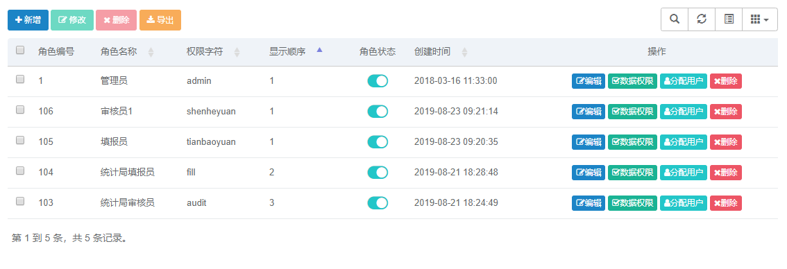

#### 用户管理

	在首页打开【系统管理】，点击【用户管理】，如图所示。
	点击顶部【新增】按钮可以进行添加用户，在弹出框中输入基本信息，点击【保存】按钮即可保存。
	在需要修改用户信息时，可以点击左侧的选中框选中需要修改的用户，点击顶部【修改】按钮，或者可以点击需要修改用户所在行的【编辑】按钮对用户信息进行修改。
	点击用户状态按钮可以切换用户的启用或停用状态。

#### 角色管理

	在角色管理页面，点击【新增】按钮可以添加角色并分配菜单权限，可以通过操作栏的按钮对已有角色进行修改、分配权限和删除。

#### 菜单管理

	在菜单管理页面，如下图，点击顶部的【新增】按钮可以添加菜单。在操作栏可以对已有菜单进行编辑、新增子菜单和删除。

#### 部门管理

	在部门管理页面，如下图，点击顶部的【新增】按钮可以添加部门。在操作栏可以对已有部门进行编辑、新增下属部门和删除。

#### 岗位管理

	在岗位管理页面，如下图，点击顶部的【新增】按钮可以添加岗位。在操作栏可以对已有岗位进行编辑、删除。

#### 字典管理

	在字典管理页面，如下图，点击顶部的【新增】按钮可以添加字典。在操作栏可以对已有字典进行编辑、删除。

#### 参数设置

	在参数设置页面，如下图，点击顶部的【新增】按钮可以添加新的参数。在操作栏可以对已有岗位进行编辑、删除。

#### 通知公告

	在通知公告页面，如下图，点击顶部的【新增】按钮可以添加岗位。在操作栏可以对已有岗位进行编辑、删除。

#### 日志管理

	在岗位管理页面，如下图，点击顶部的【新增】按钮可以添加岗位。在操作栏可以对已有岗位进行编辑、删除。

