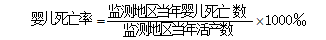

## 卫生总费用

```解释
  -  指一个国家或地区在一定时期内，为开展卫生服务活动从全社会筹集的卫生资源的货币总额，按来源法核算。它反映一定经济条件下，政府、社会和居民个人对卫生保健的重视程度和费用负担水平，以及卫生筹资模式的主要特征和卫生筹资的公平性合理性。取自卫健委核算数据。
```

## 政府卫生支出

```解释
  -  指各级政府用于医疗卫生服务、医疗保障补助、卫生和医疗保障行政管理、人口与计划生育事务性支出等各项事业的经费。取自卫健委统计数据。
```

## 社会卫生支出

```解释
  -  指政府支出外的社会各界对卫生事业的资金投入。包括社会医疗保障支出、商业健康保险费、社会办医支出、社会捐赠援助、行政事业性收费收入等。取自卫健委统计数据。
```

## 个人现金卫生支出

```解释
  -  指城乡居民在接受各类医疗卫生服务时的现金支付，包括享受各种医疗保险制度的居民就医时自付的费用。可分为城镇居民、农村居民个人现金卫生支出，反映城乡居民医疗卫生费用的负担程度。取自卫健委统计数据。
```

## 卫生总费用占GDP比重

```解释 
  -  指某年卫生总费用与同期国内生产总值（GDP）之比。是用来反映一定时期国家对卫生事业的资金投入力度，以及政府和全社会对卫生、对居民健康的重视程度。取自卫健委核算数据。
```

## 新生儿死亡率

```解释
  -  指报告期内新生儿死亡数与活产数之比。一般以千分率表示。新生儿死亡数指出生至28天以内（即0-27天）死亡人数。活产数指年内妊娠满28周及以上（如妊娠周不清楚，可参考出生体重达1000g及以上），娩出后有心跳、呼吸、脐带博动、随意肌收缩4项生命体征之一的新生儿数。取自卫健委妇幼监测网数据。
```

## 婴儿死亡率

```解释
  -  指年内未满周岁死亡的婴儿数与活产数之比。取自卫健委妇幼监测网数据。计算方法为：
```
<div align="center"></div>

## 5岁以下儿童死亡率

```解释
  -  指年内未满5岁儿童死亡人数与活产数之比。取自卫健委妇幼监测网数据。计算公式为：
```
<div align="center"></div>

## 孕产妇死亡率

```解释
  -  指报告期内每10万名孕产妇的死亡人数。孕产妇死亡指从妊娠期至产后42天内，由于任何妊娠或妊娠处理有关的原因导致的死亡，但不包括意外原因死亡者。按国际通用计算方法，“孕产妇总数”以“活产数”代替计算。取自卫健委妇幼监测网数据。
```

## 住院分娩率

```解释 
  -  指年内在取得助产技术资质的机构分娩的活产数与所有活产数之比。一般用百分率表示，取自卫健委妇幼卫生年报。
```

## 婚前医学检查率

```解释
  -  指年内进行婚前医学检查人数与应查人数之比。取自卫健委妇幼卫生年报。
```

## 妇女常见病筛查率

```解释
  -  指年内实际进行妇女常见病普查人数与常住人口中20-64岁妇女数之比。取自卫健委妇幼卫生年报。
```

## 妇女常见病患病率

```解释
  -  指年内查出进行妇科病普查时查出的妇科病患病人数与实查人数之比。取自卫健委妇幼卫生年报。
```

## 产前检查率

```解释
  -  指某地区年内产前接受过一次及以上产前检查的产妇人数与活产数之比。取自卫健委妇幼卫生年报。
```

## 产妇系统管理率

```解释 
  -  指年内产妇系统管理人数与活产数之比，一般以%表示。产妇系统管理人数指按系统管理要求，妊娠至产后28天内接受过早孕检查、至少5次产前检查、新法接生和产后访视的产妇人数。取自卫健委妇幼卫生年报。
```

## 产妇早孕建册率

```解释
  -  指年内孕产妇中由保健人员建立的保健卡（册）人数与活产数之比，一般有%表示。取自卫健委妇幼卫生年报。
```

## 低出生体重率

```解释
  -  指年内出生体重低于2500克的婴儿数与活产数之比。取自卫健委妇幼卫生年报。
```

## 5岁以下儿童生长迟缓率

```解释
  -  指对照世界卫生组织各年龄段体重标准，5岁以下儿童身高体重低于同龄标准人群中位数减2个标准差的人数占5岁以下体检儿童总数的百分比。取自卫健委抽样调查数据。
```

## 5岁以下儿童低体重率

```解释
  -  指对照世界卫生组织各年龄段体重标准，5岁以下儿童体重低于同龄标准人群中位数减2个标准差的人数占5岁以下体检儿童总数的百分比。取自卫健委抽样调查数据。
```

## 3岁以下儿童系统管理率

```解释 
  -  指年内3岁以下儿童系统管理人数与当地3岁儿童数之比，一般以%表示。3岁以下儿童系统管理指3岁以下儿童按年龄接受生长监测或4：2：1（城市）或3：2：1（农村）体检检查（身高和体重）的人数。新生儿访视时的体检次数不包括在内。取自卫健委妇幼卫生年报。
```

## 7岁以下儿童健康管理率

```解释
  -  指年内7岁以下儿童保健覆盖人数与7岁以下儿童数之比，一般以%表示。7岁以下保健覆盖人数指7岁以下儿童中当年实际接受1次及以上体格检查（身高和体重）的人数。取自卫健委妇幼卫生年报。
```

## 18岁以下儿童伤害死亡率

```解释
  -  指年内未满18岁的人群死于伤害的频率。建议以全国疾病监测系统数据为主要来源，可有其他补充。计算公式为：
```
<div align="center"></div>

## 新生儿破伤风发病率高于1‰的县数

```解释
  -  指某地区年内新生儿破伤风发病率高于1‰的县级单位个数。新生儿破伤风发病率指年内新生儿破伤风发病数与活产数之比。一般以1/万表示。新生儿破伤风指：①活产，出生后2天内正常吸吮、哭叫；②出生后第3-28天内发病；③发病后不能吸吮，进食困难，强直，抽搐。必须符合上述三项标准者才可诊断为新生儿破伤风。取自卫健委妇幼卫生年报。
```

## 卡介苗、脊髓灰质炎疫苗、百白破疫苗、含麻疹成分疫苗、乙肝疫苗、甲肝疫苗、乙脑疫苗、流脑疫苗接种率

```解释
  -  接种率指按照儿童免疫程序实际接种某疫苗人数占应接种人数的百分比。应接种人数指在某时间范围内，所辖地域范围内达到免疫程序规定应接受某疫苗接种的适龄儿童人数。实种人数指某时间段内，某地域范围内某种疫苗应种人数中实际接种人数。取自卫健委免疫规划监测信息系统资料。计算公式为：
```
<div align="center"></div>

```
     注意：卡介苗、甲肝疫苗统计单剂接种率；乙肝疫苗、百白破疫苗、脊髓灰质炎疫苗统计基础免疫第3剂接种率；含麻疹成分疫苗、乙脑疫苗统计第1剂接种率；流脑疫苗统计A群流脑疫苗第2剂接种率。
```

## 当年/累计HIV报告例数

```解释 
  -  指当年/历年累计报告的HIV感染者人数。HIV感染者指感染HIV后尚未发展到艾滋病阶段的患者。
计算方法：当年HIV报告例数是指该年1月1日至12月31日报告的艾滋病病毒感染者例数。累计HIV报告例数是指全国截至该年12月31日累计报告的艾滋病病毒感染者例数。数据取自艾滋病网络直报系统。
```

## 当年/累计AIDS报告例数

```解释
  -  是指当年/历年累计报告的艾滋病病人数。艾滋病病人指感染HIV后发展到艾滋病阶段的患者。
计算方法：当年AIDS报告例数指该年1月1日至12月31日报告的艾滋病病人例数。累计AIDS报告例数是指全国截至该年12月31日累计报告的艾滋病病人例数。数据取自艾滋病网络直报系统。
```

## 孕产妇艾滋病病毒感染率

```解释
  -  国家级艾滋病孕产妇哨点中，某年艾滋病病毒（HIV）抗体阳性数占当年孕产妇监测人群中所有参与检测人数的比例。取自国家级艾滋病监测哨点数据。
```

## 妇女梅毒年报告发病率

```解释
  -  当年1月1日零时至12月31日24时全国31个省（自治区、直辖市）通过中国疾病预防控制信息系统网络，所报告的符合卫生部颁布的卫生行业标准梅毒诊断标准的首诊病例数（包括一期、二期、三期、隐性与胎传梅毒）占当年全国妇女平均人口数的比例。取自中国疾病预防控制信息系统网络直报数据。计算公式为：
```
<div align="center"></div>