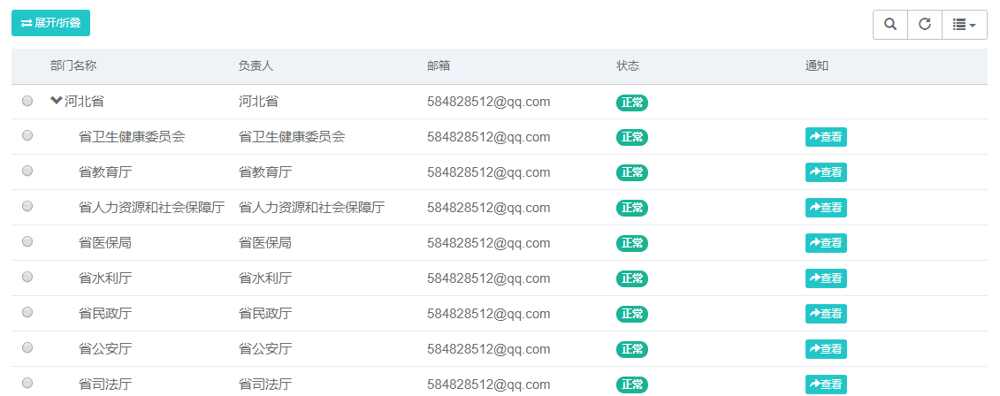
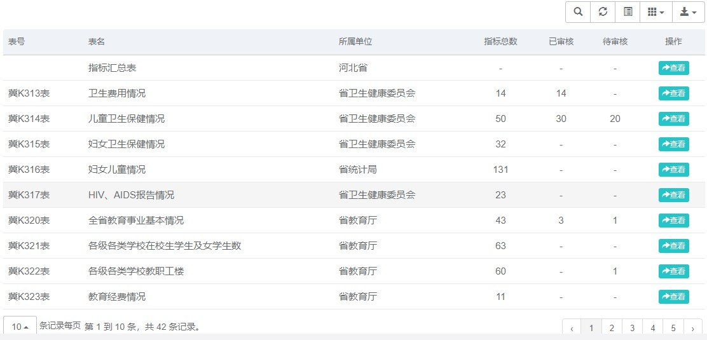
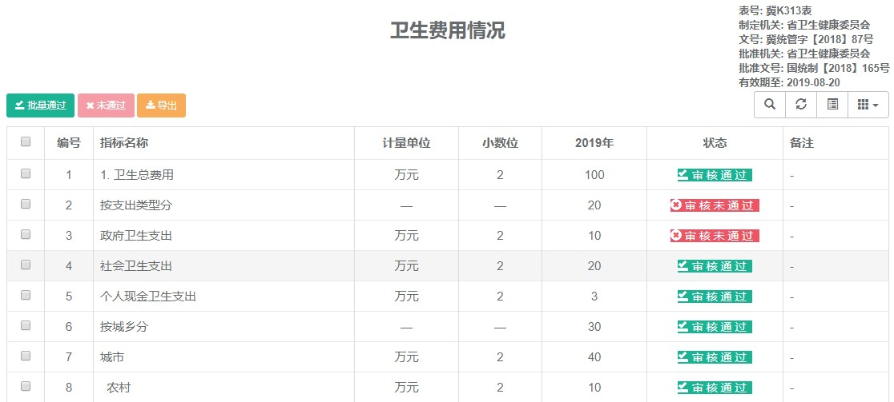
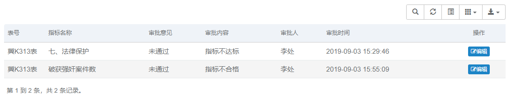

#### 审核通知
	
	在左侧导航栏点击【数据审核】菜单下的【审合通知】项，跳转到部门列表页，如下图，点击右侧【查看】按钮，打开相对应部门的审核通知列表，可以查看表单的审核信息，在右侧操作栏可以对审核通知进行查看、编辑和删除。

#### 数据审核
	在左侧导航栏点击【数据审核】菜单下的【数据审核】项，跳转到部门列表页，如下图，可以看到每个表的指标总数、已审核指标数和待审核指标数等信息。点击【查看】按钮，可以查看当前表的具体指标信息和审核状态，点击表格左上角的【批量通过】和【未通过】按钮可以审核指标是否通过审核。

#### 审核备注
	
	在左侧导航栏点击【审核备注】项，跳转到审核备注页，如下图，点击右侧操作栏中的【编辑】按钮可以修改审批意见。

